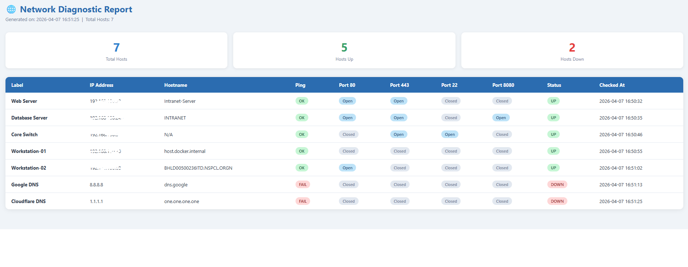

# Network Diagnostic & Monitoring Tool

A Python script I built to monitor internal network nodes. It pings a list of IPs, checks if common ports are open, and generates a simple HTML report showing which systems are up or down. Logs are saved with timestamps so you can track history.

---

## Why I built this

At work I often had to manually check if internal servers or network devices were reachable. This tool automates that — just add your IPs to a file and run the script. It tells you what's up, what's down, and saves a report you can open in the browser.

---

## What it does

- Pings each host to check if it's reachable
- Scans ports 80, 443, 22, 8080
- Tries to resolve IP to hostname
- Saves results to `monitor.log` with timestamps
- Generates `report.html` — a simple status dashboard

---

## Sample Output 



## Setup

**Install dependencies:**
```bash
pip install -r requirements.txt
```

**Add your hosts to `hosts.txt`:**
```
192.168.1.1, Main Gateway
192.168.1.10, Web Server
192.168.1.20, Mail Server
```

**Run it:**
```bash
python monitor.py
```

Then open `report.html` in your browser.

---

## Schedule it (optional)

**Linux/macOS** — run every 5 minutes via cron:
```bash
crontab -e
# add this line:
*/5 * * * * /usr/bin/python3 /path/to/monitor.py
```

**Windows** — use Task Scheduler, set it to run `monitor.py` every 5 minutes.

---

## Config options

At the top of `monitor.py` you can change:
- `PORTS_TO_CHECK` — which ports to scan
- `PING_COUNT` — how many ping attempts
- `LOG_FILE` / `REPORT_FILE` — output file names

---

## Tech used

Python 3, `socket`, `subprocess`, `logging`, `jinja2`

---

## Author

Nandini Jampana — nandinijampana528@gmail.com
